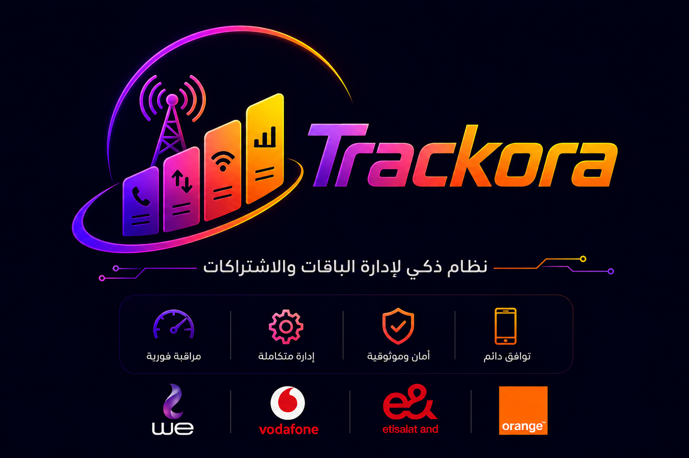

<div align="center">
  

  # Trackora — Smart Subscription & Package Management SaaS

  **A multi-tenant SaaS platform for managing telecom package subscriptions across Egypt's major operators**

  [](https://developers.google.com/apps-script)
  [](https://sheets.google.com)
  [](https://developer.mozilla.org/en-US/docs/Web/HTML)
  [](https://vodafone.com.eg)
  [](https://orange.eg)
  [](https://etisalat.eg)
  [](https://te.eg)

</div>

---

## 📖 Overview

**Trackora** is a full-featured, multi-tenant SaaS platform that empowers resellers and telecom agents to manage and sell internet/voice packages from Egypt's four major operators — **Vodafone**, **Orange**, **e& (Etisalat)**, and **WE** — through branded, store-specific customer portals.

Each client (store) gets a unique link, a customized brand experience, and a dedicated Google Sheets backend for orders, package listings, and configurations — all managed via a powerful admin panel.

---

## ✨ Key Features

### 🏪 Multi-Tenant Store System
- Each client gets a unique `?store=CL-XXXXX` storefront URL
- Custom branding: store name, logo, contact numbers, WhatsApp group link
- Isolated order tracking per store

### 📦 Package Management
- Support for **Vodafone**, **Orange**, **e&**, and **WE** packages
- Filter packages by type: Data (جيجا), Minutes (دقايق), or Mixed (ميكس)
- Live package catalogue synced from Google Sheets

### 🛒 Customer Booking Flow (3-Step Wizard)
1. **Step 1** — Select telecom operator
2. **Step 2** — Browse & select package with smart filtering
3. **Step 3** — Enter personal details, choose payment method, upload receipt

### 💳 Payment Integration
- **InstaPay** (account number configurable per store)
- **Cash** (phone number configurable per store)
- Receipt image upload with base64 encoding

### 📊 Admin Portal
- View, filter, search, and manage all orders
- Update order status (Pending → Activated / Cancelled)
- Export orders to Excel
- Real-time dashboard with order statistics

### 👑 Owner Portal
- Full store configuration control
- Package management (add/edit/delete)
- Billing and subscription management
- Store activation/deactivation

### 🔐 Super Admin Panel
- Manage all clients across the platform
- Broadcast messages to all stores
- Global package updates

### ⚡ Performance
- Client-side package caching (30-minute TTL)
- Skeleton loading states
- Optimized image preloading

---

## 🏗️ Architecture

```
Trackora SaaS
│
├── 🌐 Frontend (HTML / CSS / Vanilla JS)
│   ├── index.html          → Customer booking portal (multi-tenant)
│   ├── admin.html          → Admin order management panel
│   ├── portal.html         → Owner store management portal
│   ├── owner-portal.html   → Owner billing & advanced settings
│   ├── super-admin.html    → Super admin global management
│   └── tracker.html        → Order tracking page
│
└── ⚙️ Backend (Google Apps Script)
    ├── Client.gs           → Customer-facing API (store config, packages, order submission)
    ├── Admin.gs            → Admin API (order status management)
    ├── Tracker.gs          → Order tracking API
    └── SuperAdmin.gs       → Super admin API (global management)
```

### Data Flow

```
Customer → index.html → Google Apps Script (Client.gs) → Google Sheets
                                  ↓
                        Order stored → Admin notified via WhatsApp
                                  ↓
Admin → admin.html → Updates order status → Customer package activated
```

---

## 🚀 Getting Started

### Prerequisites

- A Google Account
- Google Sheets access
- Google Apps Script enabled

### Deployment

1. **Set up Google Sheets**
   - Create a master spreadsheet with sheets: `Clients`, `Packages`, `Orders`
   - Configure the sheet structure as per the expected schema

2. **Deploy Google Apps Script**
   - Open **Google Apps Script** from your spreadsheet
   - Copy the `.gs` files into the project
   - Deploy as **Web App** with access set to *Anyone*
   - Copy the deployment URL

3. **Configure the Frontend**
   - Update `SCRIPT_URL` in `index.html` with your deployment URL
   - Upload the HTML files to your hosting (GitHub Pages, Firebase Hosting, etc.)

4. **Onboard a New Client**
   - Use the Super Admin panel to create a new store entry
   - Assign a `CL-XXXXX` client ID
   - Client accesses their store via: `https://your-domain.com/index.html?store=CL-XXXXX`

---

## 📱 Portal URLs

| Portal | URL | Access |
|--------|-----|--------|
| Customer Store | `index.html?store=CL-XXXXX` | Public |
| Order Tracker | `tracker.html?id=ORD-XXXXX` | Public |
| Admin Panel | `admin.html` | Store Admins |
| Owner Portal | `portal.html` | Store Owners |
| Super Admin | `super-admin.html` | Platform Owner |

---

## 🎨 UI Design

- **Dark theme** with deep navy/purple gradient background
- **Cairo font** (Google Fonts) for full Arabic RTL support
- **Glassmorphism** cards with purple/orange accent colors
- **Smooth micro-animations**: floating logo, skeleton loaders, shimmer effects
- **Fully responsive** — optimized for mobile-first usage
- Supported operators displayed with official brand logos

<div align="center">

| Supported Operators | | | |
|:---:|:---:|:---:|:---:|
|  |  |  |  |
| Vodafone | Orange | e& (Etisalat) | WE |

</div>

---

## 🔧 Configuration Per Store

Each store can be configured with the following parameters via the Owner Portal:

| Setting | Description |
|---------|-------------|
| `appBrandName` | Store display name |
| `appLogoUrl` | Custom store logo URL |
| `phone1` / `phone2` | WhatsApp contact numbers |
| `whatsappGroup` | WhatsApp group invite link |
| `guaranteeLink` | Service guarantee link |
| `instapayNumber` | InstaPay account for payments |
| `cashNumber` | Cash contact number |

---

## 📂 File Structure

```
Trackora-SaaS/
├── index.html           # Customer booking portal
├── admin.html           # Admin management panel
├── portal.html          # Owner portal
├── owner-portal.html    # Advanced owner settings
├── super-admin.html     # Super admin dashboard
├── tracker.html         # Order status tracker
├── Client.gs            # Customer-facing backend API
├── Admin.gs             # Admin backend API
├── Tracker.gs           # Tracker backend API
├── SuperAdmin.gs        # Super admin backend API
├── logo.png             # Trackora brand logo
├── default.png          # Default store logo
├── vodafone_logo.png    # Vodafone operator logo
├── Orange_logo.svg.png  # Orange operator logo
├── Eand_Logo_EN.svg.png # e& (Etisalat) operator logo
├── We_logo.svg.png      # WE operator logo
└── deploy.ps1           # Deployment helper script
```

---

## 🌐 Technology Stack

| Layer | Technology |
|-------|-----------|
| Frontend | HTML5, CSS3, Vanilla JavaScript |
| Backend | Google Apps Script |
| Database | Google Sheets |
| Fonts | Google Fonts (Cairo) |
| Hosting | Any static hosting (GitHub Pages, Firebase, etc.) |
| Payments | InstaPay / Cash |
| Notifications | WhatsApp (via wa.me links) |

---

## 📄 License

This project is proprietary software. All rights reserved.

---

<div align="center">

---

*Designed & Developed with ❤️ by*

**Eng. Hamdy Haggag**

[](https://wa.me/201154620997)

© 2025 Trackora. All Rights Reserved.

</div>
